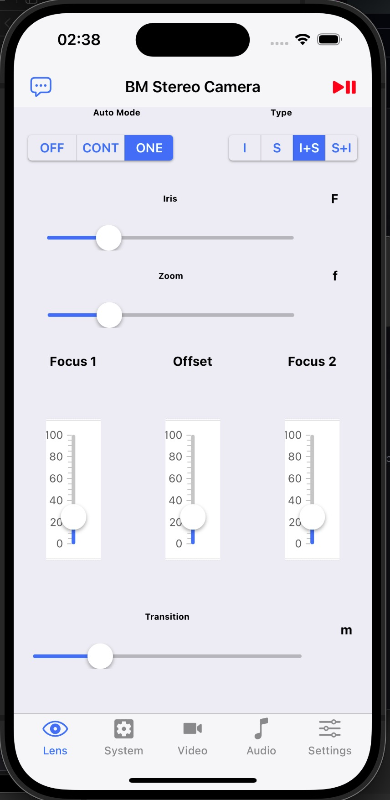
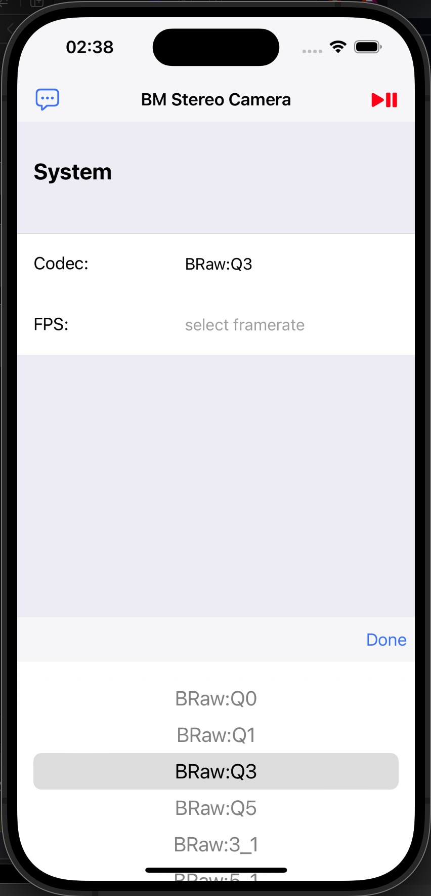
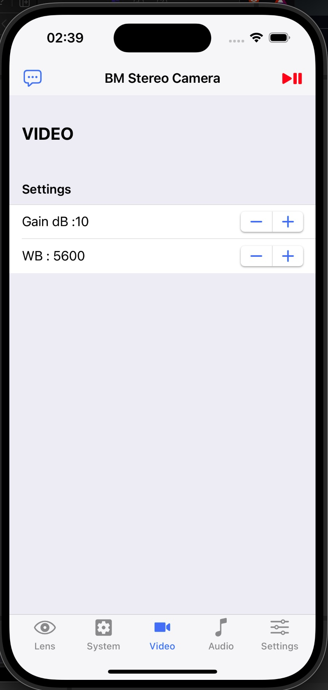
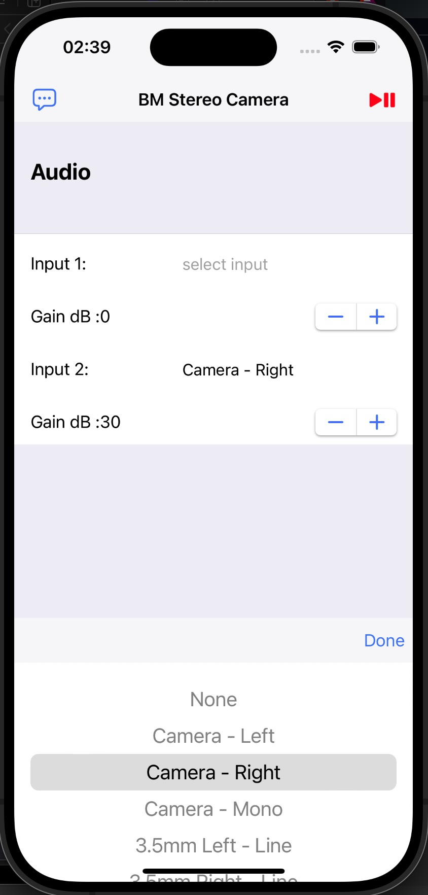
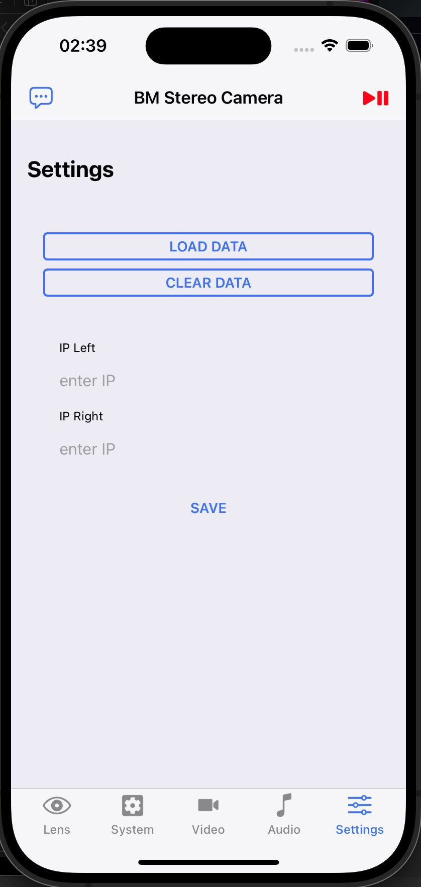

# bm3dcam
stereoscopic 3D camera remote for Blackmagic Micro Studio 4K G2 Camera

## Description 
Prototype for a remote control using the REST API of the [Blackmagic Camera Control SDK](https://documents.blackmagicdesign.com/DeveloperManuals/BlackmagicCameraControl.pdf).

## Screenshots

### Lens Menu

### System Menu

### Video Menu

### Audio Menu

### Settings Menu

